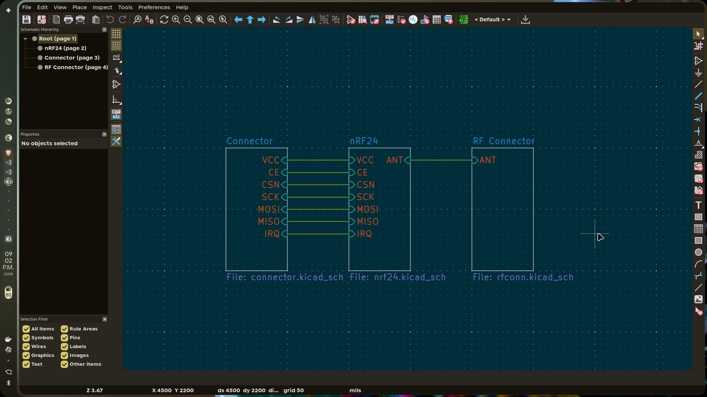
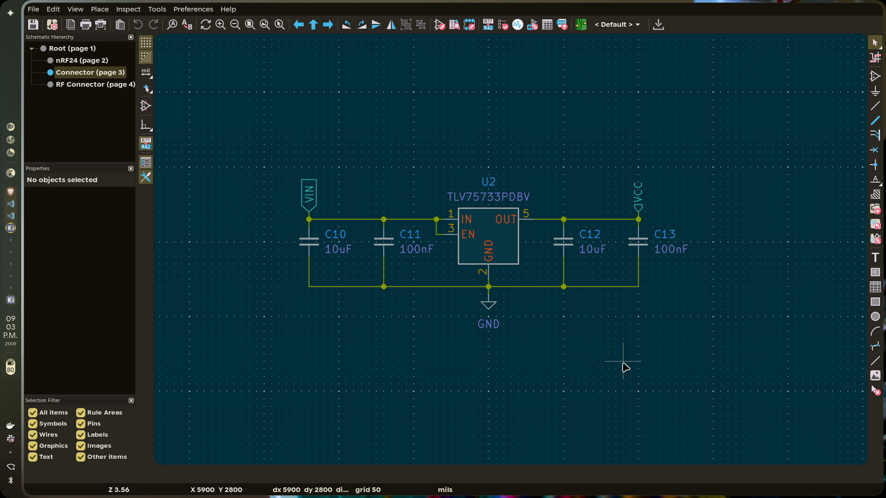
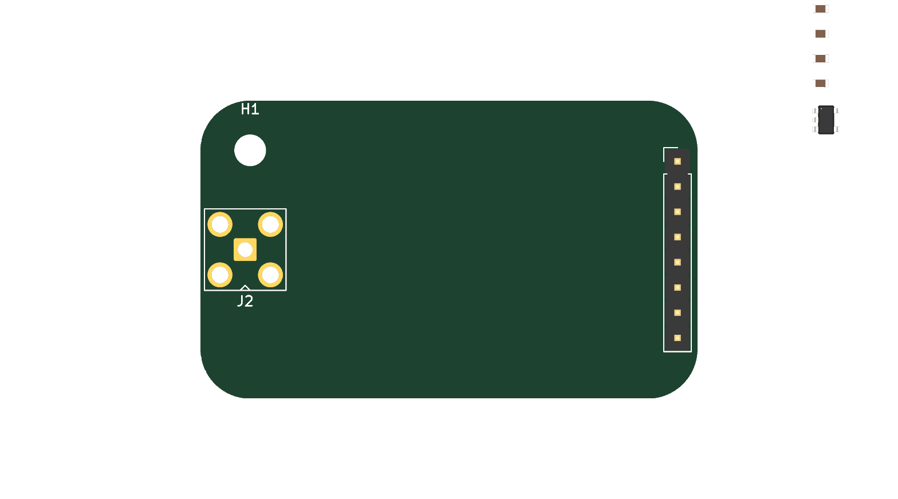
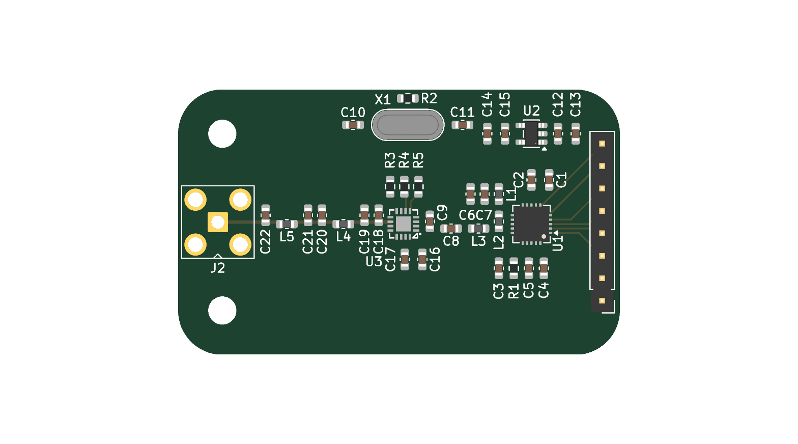
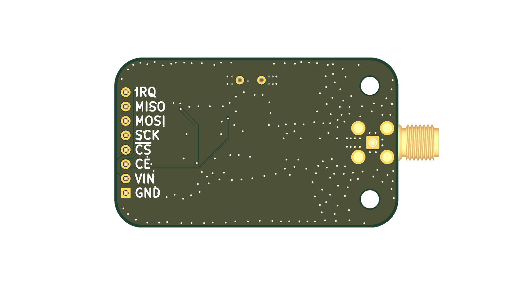

# September 20: Schematic done, board started, ERC clean

## What I did:

- Set up the KiCad project: root sheet plus two sub-sheets (radio + connector)
- Placed the nRF24L01P+ and built the RF front end by hand: LC balun and harmonic filter out to an SMA jack
- Added the 16MHz crystal with load caps and bias resistor
- Critically wired VDD_PA filter so the PA supply and balun share cleanly
- Ran the interface off one 1x08 2.54mm header: GND, VCC, CE, CSN, SCK, MOSI, MISO, IRQ
- 1x08 header is more breadboard friendly than the standard 2x4 header
- Ran ERC - no violations
- Started the PCB: 20 footprints placed manually on a board, routing not started
- Exported schematic PNGs into images/schematic/

## Why:

- I want a real nRF24 board (with a PA/LNA??) instead of a module, so the RF path is fully mine to tune and I get a proper SMA port instead of just a pcb antenna
- The PA outputs (ANT1/ANT2) are differential; they need a balun to reach a 50 ohm single-ended antenna, and the same LC network stops harmonics
- 2/4 layer (undecided), cheap fab because this is the first spin and the RF budget is modest

## Screenshots:

**Total time spent: 1 hours**

# September 21: rf connector sheet

## What I did:

- Made a new sheet for the sma connector and balun
- Added a 3.3v regulator

## Why:

- Planning on adding a PA/LNA to the nRF24 to boost its range
- 3.3v regulator so that it can be powered from 5v mcus too hopefully

## Screenshots:

**Total time spent: 1 hour**

# September 24: PA/LNA in, board started

## What I did:

- Grabbed the RFX2401C symbol and footprint and dropped it on a new PA_LNA sheet (U3)
- Wired the nRF24 balun output onto the PA input (TXRX) and the antenna pin out to an LC match + DC block
- Control pins pulled through 1k resistors
- Gave the SMA connector its own RF connector sheet so the RF chain is easy to read
- Put the header and a TLV75733 LDO on the connector sheet so 5V hosts can feed the board
- Added 2x M3 mounting holes to the root sheets
- Grew the board from ~34x29 to 53.5x34mm, 1-layer to 2-layer, to fit the PA/LNA and its RF line
- Placed all 40 footprints, starting the board for the routing pass

## Why:

- The nRF24L01P+ internal PA only does about +0dBm
- RFX2401C adds a real PA (~+20dBm) plus an LNA, so improved range
- The radio's PA is differential and the PA/LNA is single-ended, so the balun has to hand the RFX2401C a clean 50 ohm line, then match the PA side back to the antenna
- Registering the parts project-local (kicad/parts/) so the schematic builds without depending on a global library

## Screenshots:

**Total time spent: 1 hour**

# September 24: Routed the board

## What I did:

- Started routing at 21:09 off the 40-footprint placement
- Routed the first signals by hand: SPI, CE, IRQ, the crystal pair, then the power nets
- Tried a bulk auto-route pass through freerouting (DSN export) twice - both times it buried the RF traces under vias, so I undid it and did the whole thing by hand
- Left the RF chain (balun to PA to SMA) as the cleanest, shortest run on top
- Finished at 21:50: 126 tracks and 219 vias, mostly via fan-out for the ground return on the 2-layer stack

## Why:

- The 2.4GHz path is the whole point of this board, so it had to be a deliberate hand route, not whatever a bulk router churns out
- 2-layer boards only have the one solid ground return, so I leaned on stitched vias to keep GND continuous under the RF line instead of skimping
- The board grew to fit a proper layout: 53.5x34mm so the SMA hangs off the edge and the header stays breadboard friendly

## Screenshots:

**Total time spent: 2 hour**