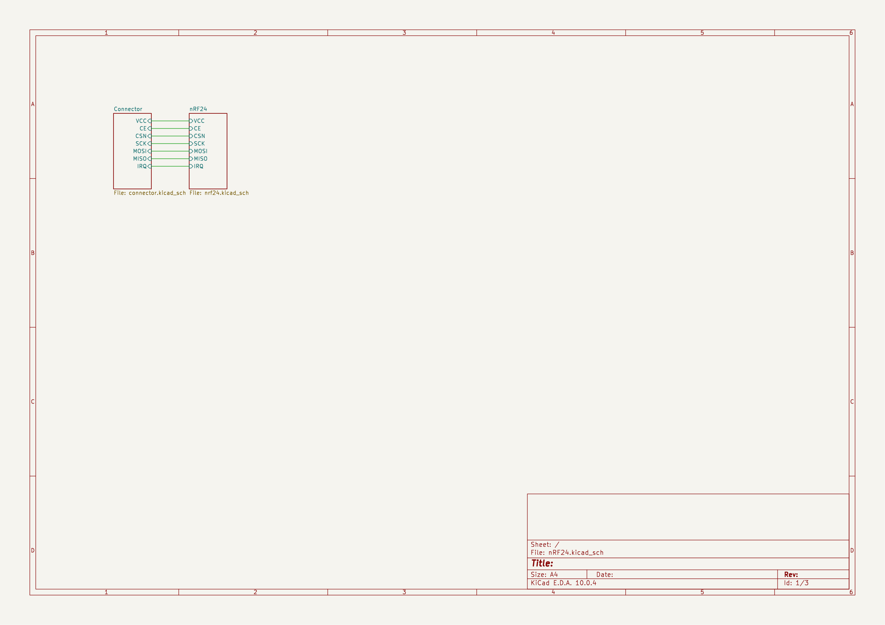

# September 20: Schematic done, board started, ERC clean

## What I did:

- Set up the KiCad project: root sheet plus two sub-sheets (radio + connector)
- Placed the nRF24L01P+ and built the RF front end by hand: LC balun and harmonic filter out to an SMA jack
- Added the 16MHz crystal with load caps and bias resistor
- Critically wired VDD_PA filter so the PA supply and balun share cleanly
- Ran the interface off one 1x08 2.54mm header: GND, VCC, CE, CSN, SCK, MOSI, MISO, IRQ
- 1x08 header is more breadboard friendly than the standard 2x4 header
- Ran ERC - no violations
- Started the PCB: 20 footprints placed manually on a board, routing not started
- Exported schematic PNGs into images/schematic/

## Why:

- I want a real nRF24 board (with a PA/LNA??) instead of a module, so the RF path is fully mine to tune and I get a proper SMA port instead of just a pcb antenna
- The PA outputs (ANT1/ANT2) are differential; they need a balun to reach a 50 ohm single-ended antenna, and the same LC network stops harmonics
- 2/4 layer (undecided), cheap fab because this is the first spin and the RF budget is modest

## Screenshots:

**Total time spent: 1 hours**