# September 20: Schematic done, board started, ERC clean

## What I did:

- Set up the KiCad project: root sheet plus two sub-sheets (radio + connector)
- Placed the nRF24L01P+ and built the RF front end by hand: LC balun and harmonic filter out to an SMA jack
- Added the 16MHz crystal with load caps and bias resistor
- Wired VDD_PA filter so the PA supply and balun share cleanly
- Ran the interface off one 1x08 2.54mm header: GND, VCC, CE, CSN, SCK, MOSI, MISO, IRQ
- 1x08 header is more breadboard friendly than the standard 2x4 header
- Ran ERC - no violations
- Started the PCB: 20 footprints placed manually on a board, routing not started
- Exported schematic PNGs into images/schematic/

## Why:

- I want a real nRF24 board (with a PA/LNA??) instead of a module, so the RF path is fully mine to tune and I get a proper SMA port instead of just a pcb antenna
- The PA outputs (ANT1/ANT2) are differential; they need a balun to reach a 50 ohm single-ended antenna, and the same LC network stops harmonics
- 2/4 layer (undecided), cheap fab because this is the first spin and the RF budget is modest

## Screenshots:

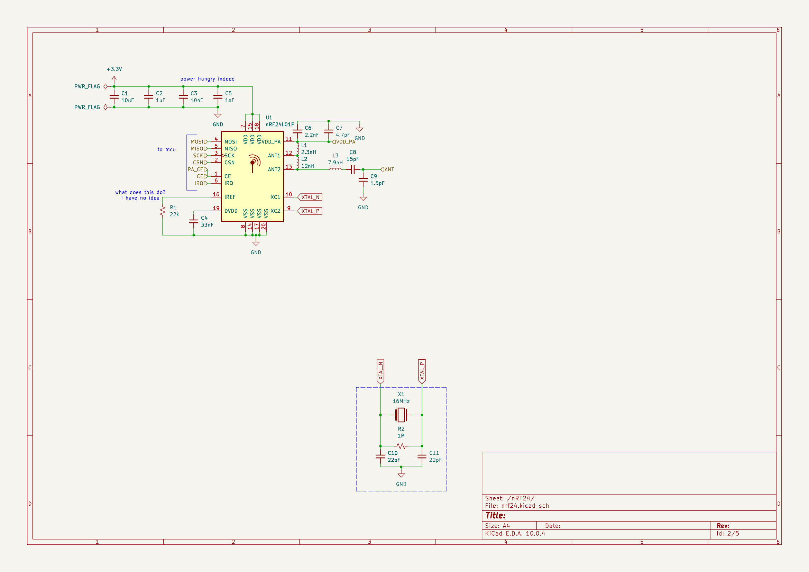

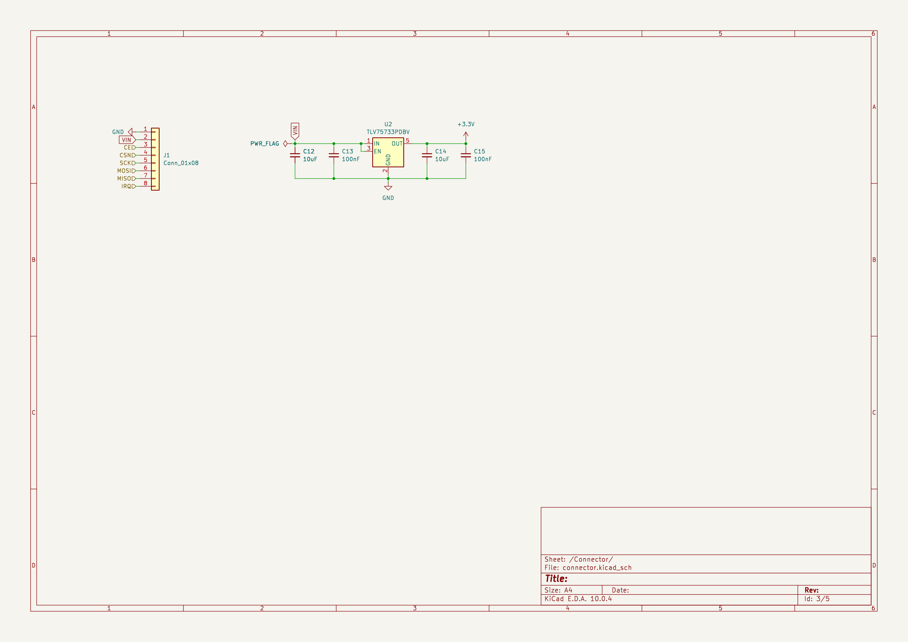

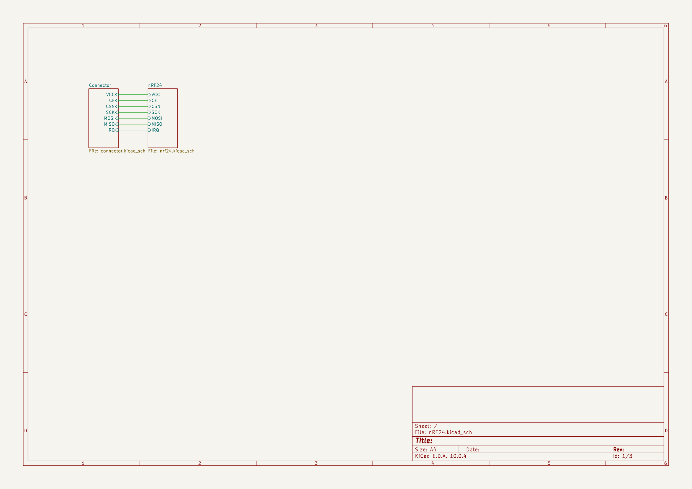

**Total time spent: 1 hour**

# September 21: rf connector sheet

## What I did:

- Made a new sheet for the sma connector and balun
- Added a 3.3v regulator

## Why:

- Planning on adding a PA/LNA to the nRF24 to boost its range
- 3.3v regulator so that it can be powered from 5v mcus too hopefully

## Screenshots:

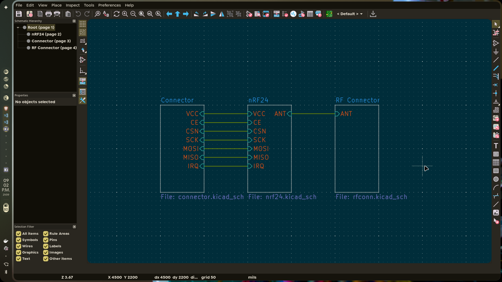
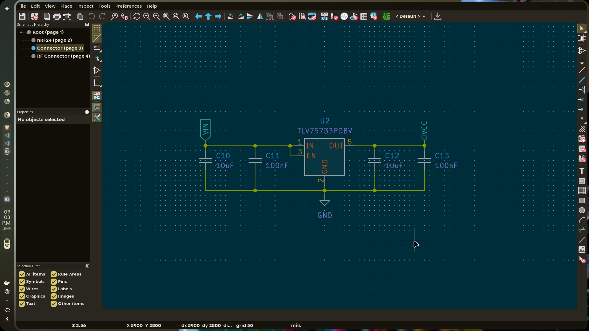

**Total time spent: 1 hour**

# September 24: PA/LNA in, board started

## What I did:

- Grabbed the RFX2401C symbol and footprint and dropped it on a new PA_LNA sheet (U3)
- Wired the nRF24 balun output onto the PA input (TXRX) and the antenna pin out to an LC match + DC block
- Control pins pulled through 1k resistors
- Gave the SMA connector its own RF connector sheet so the RF chain is easy to read
- Put the header and a TLV75733 LDO on the connector sheet so 5V hosts can feed the board
- Added 2x M3 mounting holes to the root sheets
- Grew the board from ~34x29 to 53.5x34mm, 1-layer to 2-layer, to fit the PA/LNA and its RF line
- Placed all 40 footprints, starting the board for the routing pass

## Why:

- The nRF24L01P+ internal PA only does about +0dBm
- RFX2401C adds a real PA (~+20dBm) plus an LNA, for improved range
- The radio's PA is differential and the PA/LNA is single-ended, so the balun has to hand the RFX2401C a clean 50 ohm line, then match the PA side back to the antenna
- Registering the parts project-local (kicad/parts/) so the schematic builds without depending on a global library

## Screenshots:

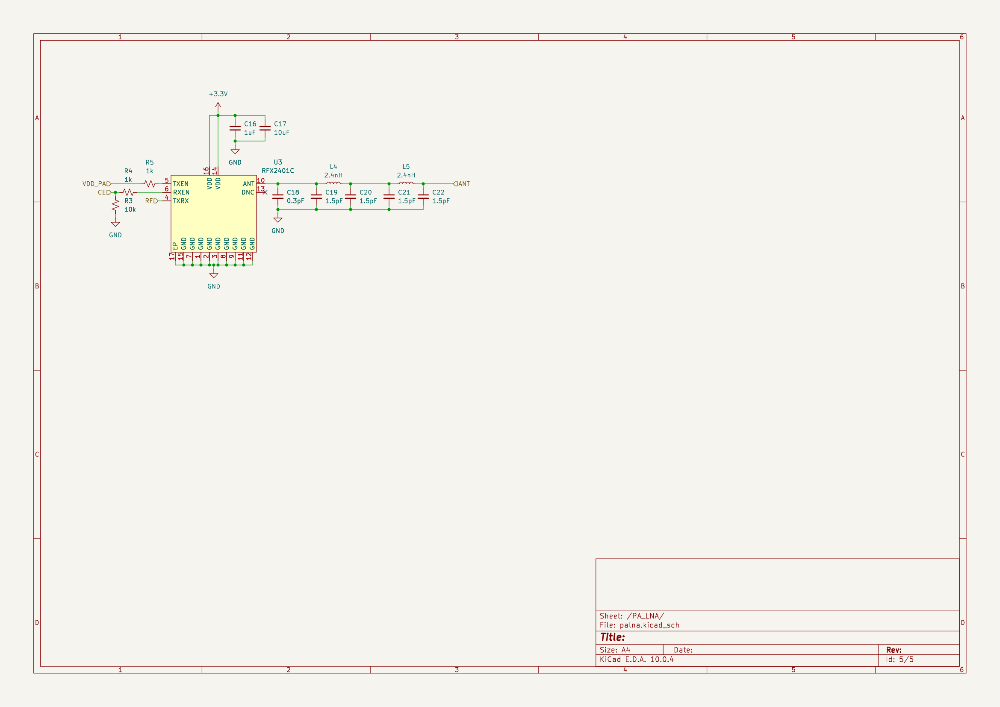

**Total time spent: 1 hour**

# September 24: Routed the board

## What I did:

- Started routing at 21:09 off the 40-footprint placement
- Routed the first signals by hand: SPI, CE, IRQ, the crystal pair, then the power nets
- Tried a bulk auto-route pass through freerouting (DSN export) twice - both times it buried the RF traces under vias, so I undid it and did the whole thing by hand
- Left the RF chain (balun to PA to SMA) as the cleanest, shortest run on top
- Finished at 21:50: 126 tracks and 219 vias, mostly via fan-out for the ground return on the 2-layer stack

## Why:

- The 2.4GHz path is the whole point of this board, so it had to be a deliberate hand route, not whatever a bulk router churns out
- 2-layer boards only have the one solid ground return, so I leaned on stitched vias to keep GND continuous under the RF line instead of skimping
- The board grew to fit a proper layout: 53.5x34mm so the SMA hangs off the edge and the header stays breadboard friendly

## Screenshots:

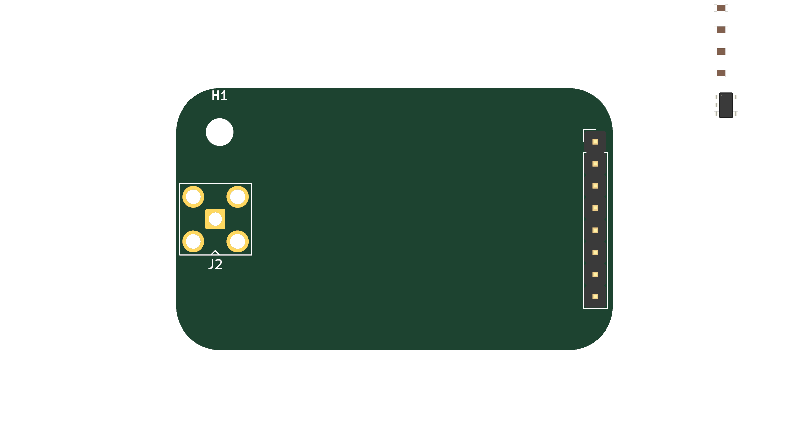

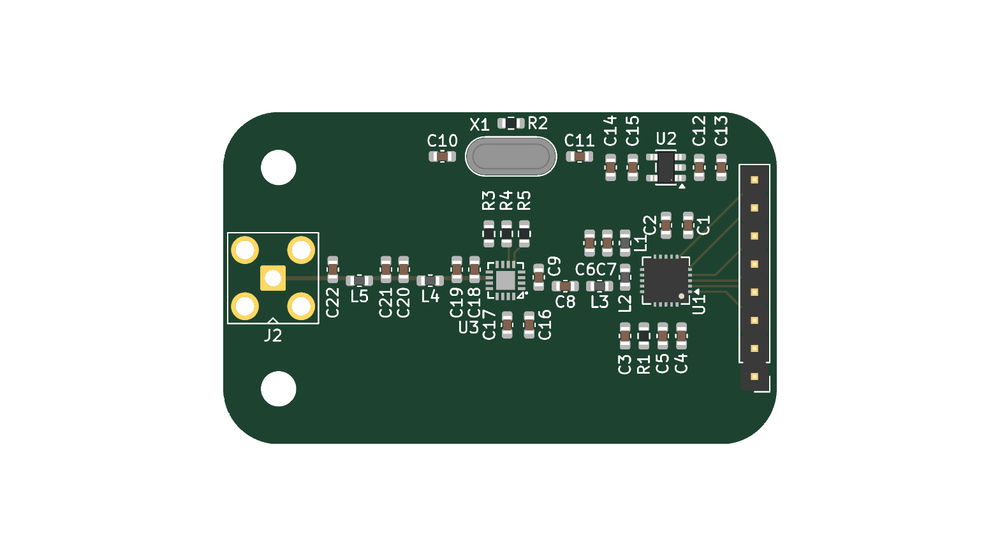

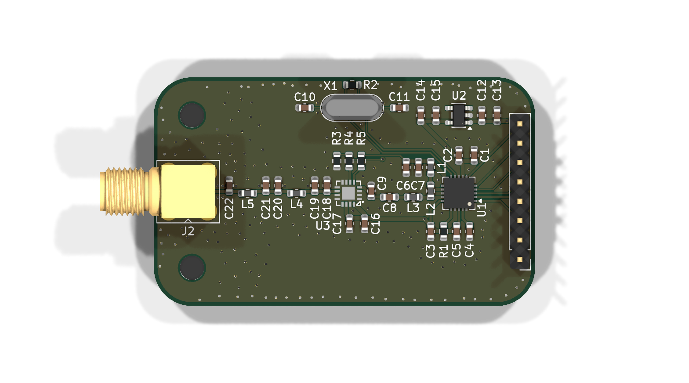

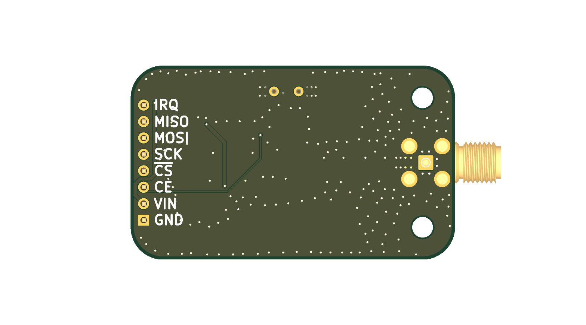

**Total time spent: 2 hours**

# September 26: BOM, licenses, and a lot of checking

## What I did:

- Built BOM.csv off the production bom
- Added LICENSE (CERN OHL v2-P) and LICENSE-MIT
- Fixed the board size in the README
- Measured the routed antenna trace: U3-ANT is 0.4mm single-ended over solid ground on 1.6mm FR4, which works out to about 122 ohm rather than 50
- Worked out that there is no trace width that fixes it on 2 layers at 1.6mm. 50 ohm needs 3.3mm, but the shunt caps are 0603 on a 1.575mm pitch, so a 3.3mm trace swallows them and the C-L-C-L-C ladder stops being a ladder
- A 4-layer stack with 0.21mm prepreg hits 50 ohm at 0.46mm, so the width I drew is about right for 4 layers and badly wrong for the 2-layer board it is on
- L1 (2.3nH) and L3 (7.9nH) have no 0603 part at those values. Every 0603-numbered 2.3nH in the catalog is physically 0201, which will not sit on a 0603 pad. Swapped to 0402, small enough to land inside the existing pads
- L2 (12nH) has a self-resonant frequency of 3GHz, uncomfortably close to running at 2.4GHz
- Added a .gitignore, and untracked kicad/.history. It was committed as a gitlink with no .gitmodules entry, so cloning the repo errored out on submodule status

## Why:

- Forge wants a supplier link on every line item and a total
- CERN OHL v2-P because this is a personal 5-board build, not a product. Relicense to -S if boards are ever sold
- The board size was wrong because I wrote 53.5x34mm from memory instead of measuring the outline. Same for the trace impedance, and the first number I wrote for that was wrong too, in the other direction. Both are the kind of thing you only catch by measuring, so both are written down now

## Screenshots:

**Total time spent: 1 hour**

# September 26: Back to 4 layers

## What I did:

- Switched the stackup to JLCPCB's JLC04161H-7628: 4 layers, 0.2104mm of prepreg down to In1.Cu, 1.065mm core, 1.6062mm total
- Put a solid GND plane on In1.Cu and the +3.3V plane on In2.Cu. F.Cu keeps all the routing, B.Cu keeps the 10 CE and VIN runs
- Left the 221 through vias alone. They already tie F.Cu down to ground, and now that there is a ground plane 0.245mm under the antenna that is exactly what I wanted
- Recomputed the antenna trace against the real prepreg instead of an assumed 1.6mm of solid FR4: 0.4mm is 54 ohm, 0.46mm is 50 ohm and holds 46-54 ohm across the prepreg and er spread JLC holds
- Rewrote the README for the 4-layer stackup and pulled the stale 2-layer and 70 ohm figures out of it

## Why:

- 2 layers at 1.6mm cannot do 50 ohm here. 50 ohm needs 3.3mm of trace, the shunt caps are 0603 on a 1.575mm pitch, so anything that wide stops being a matching ladder
- A ground plane 0.2104mm under the trace is what makes the impedance a number I can calculate instead of guess at

## Still to do:

- Widen the antenna run from 0.4mm to 0.46mm. It is a 0.06mm change to 16.8mm of track
- Clear the F.Cu ground pour back off the antenna run. Until that is done the trace is a coplanar waveguide, not a microstrip, and the 50 ohm above is not what the board will actually do
- Chase up the two 0.2mm segments still sitting on the antenna nets
- Get a real 4-layer quote from JLCPCB. The $10.00 in the README was a 2-layer estimate and is now marked pending rather than guessed at

## Screenshots:

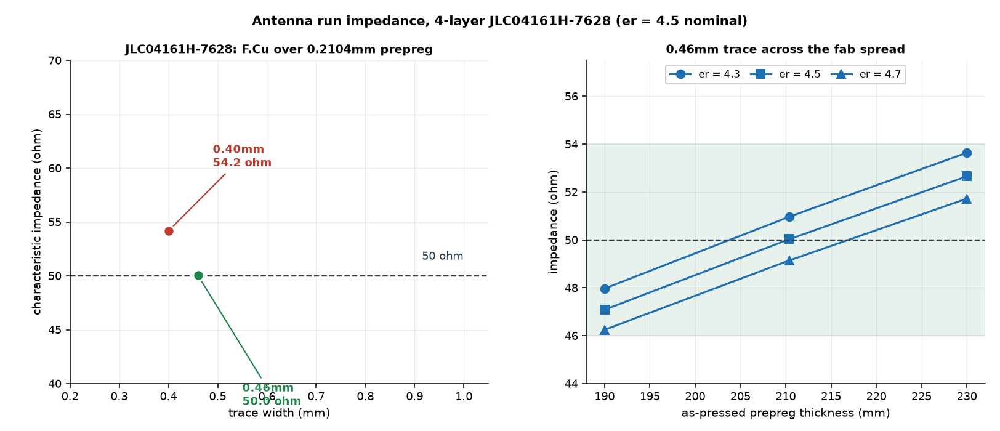

**Total time spent: 1 hour**
