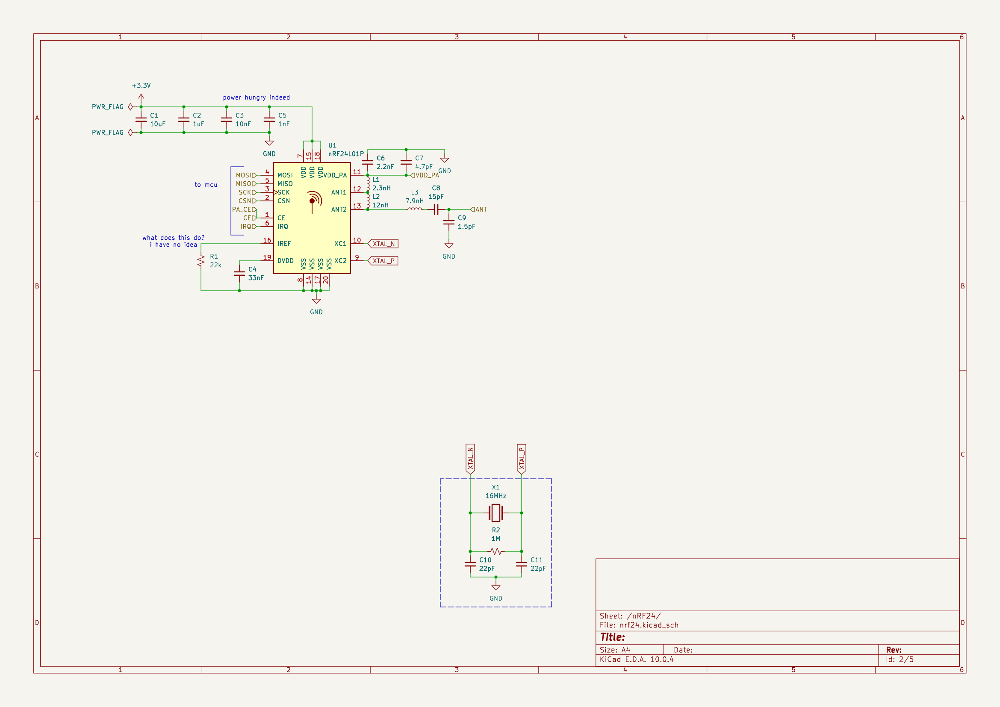
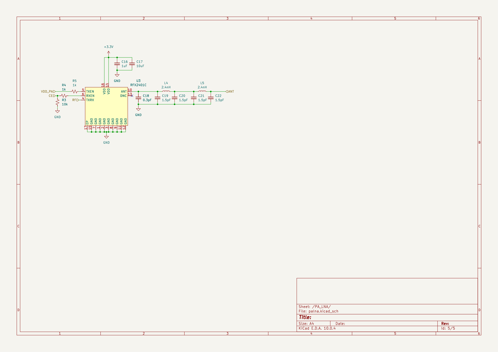
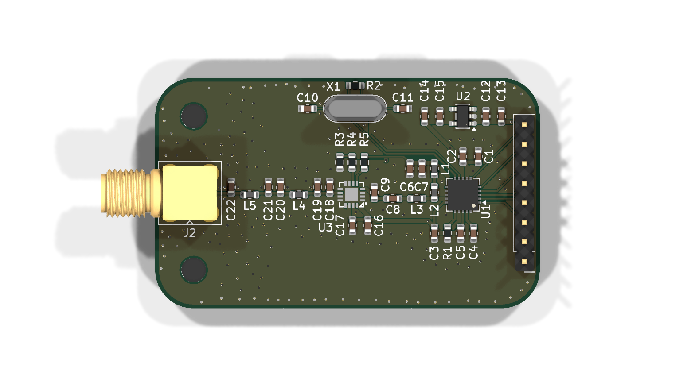
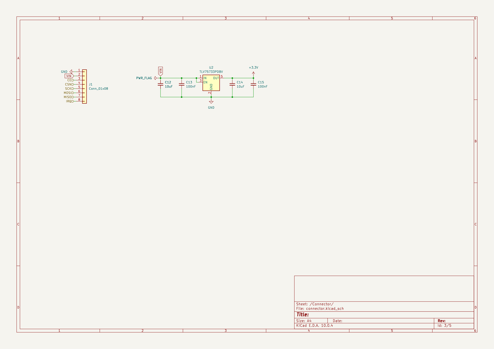

# nRF24 Breakout Board

A small module based on the nRF24L01P+, with a proper SMA jack for an external
antenna, an on-board RFX2401C PA/LNA for extra range, and a breadboard friendly
SPI header. Runs from 3.3V or 5V thanks to an on-board LDO.





## Custom Features

- nRF24L01P+ 2.4GHz transceiver, QFN-20
- RFX2401C external PA/LNA on the TXRX line for roughly +20dBm in TX and LNA gain in RX
- Discrete LC balun + harmonic filter: differential ANT1/ANT2 to a single 50 ohm line
- LC match and DC block from the PA/LNA out to the SMA jack (0.3-2.4nH family, 1.5pF caps)
- SMA jack (Amphenol 901-143) for a real whip or panel antenna
- 16MHz crystal with matched load caps and bias resistor
- PA supply (VDD_PA) decoupled separately from the digital rail
- TLV75733 LDO: feed the header 3.3V or 5V and the board regulates itself
- 1x08 2.54mm header for drop-in SPI control from any MCU
- 2x M3 mounting holes

## How It Works

The host MCU talks SPI over the header. The nRF24L01P+ differential PA
outputs (ANT1/ANT2) go through the LC balun and harmonic filter to become a
single 50 ohm line, which lands on the RFX2401C PA/LNA. The PA amplifies it
and sends it through an LC match and DC block onto the SMA jack. In the
other direction the LNA boosts received signals back down the same line.

The 16MHz crystal clocks the radio; a 1M bias resistor plus 22pF load caps
set the oscillator up.

### Power Tree


## PCB Design

53.5 x 34 mm, 2-layer, 1.6mm thick. 40 footprints, fully routed first pass
(126 tracks, 219 vias). The PA/LNA sits on the RF line between the radio and
the SMA, which hangs off the board edge. No copper pour yet - ground returns
must be checked before fab.





## Firmware

None yet.

maybe SPI peripheral on an STM32/AVR host (TBD).

## Usage

Wire the header to the MCU, drive CE/CSN/SCK/MOSI/MISO per the nRF24L01
datasheet, attach an antenna to SMA, then start transmitting. Pin 2 takes
3.3V or 5V - the on-board LDO handles the rest, but the logic pins still run
at 3.3V.

| Pin | Function        |
|-----|-----------------|
| 1   | GND             |
| 2   | VIN (3.3-5V)    |
| 3   | CE              |
| 4   | CSN             |
| 5   | SCK             |
| 6   | MOSI            |
| 7   | MISO            |
| 8   | IRQ             |

## BOM (Bill of Materials)

Costs and supplier links not finalized yet (TBD). Silicon: nRF24L01P+
(QFN-20), RFX2401C (QFN-16), TLV75733 LDO (SOT-23-5). Passives all 0603.
See [BOM.csv](BOM.csv) for the full part list with supplier links (pending).

| Item | Cost |
|------|------|
| PCB (qty 5, 2-layer) | TBD |
| Components (per board) | TBD |
| **Total** | **TBD** |

See [BOM.csv](BOM.csv) for the full part list with supplier links.

## Production

Not built yet

## Repository Structure

```
├── kicad/            # PCB source files (.kicad_sch / .kicad_pcb)
│   └── parts/        # Project-local symbol / footprint / 3D libs
├── images/           # Schematic exports and renders
│   └── schematic/    # Per-sheet PNGs
├── BOM.csv           # Bill of materials (pending)
└── JOURNAL.md        # Work journal
```

## Known Issues

- Board is routed but unassembled and untested
- PA/LNA match uses tight-tolerance parts (0.3pF / 1.5pF / 2.4nH); the values may need tuning on the first real board
- No ground pour yet; on a 2-layer board with +20dBm the return path needs checking
- TXEN/RXEN control of the RFX2401C is wired to VDD_PA and CE through 1k resistors - direction switching is a prototype hack, revisit if it misbehaves

## Credits & Inspiration

- [nRF24L01+ Product Spec](https://www.nordicsemi.com/products/nrf24l01) - reference balun/matching values and pinout
- RFX2401C symbol and footprint from the incutec-KiCad-Library (OpenRX FPGA project)

## License

TBD